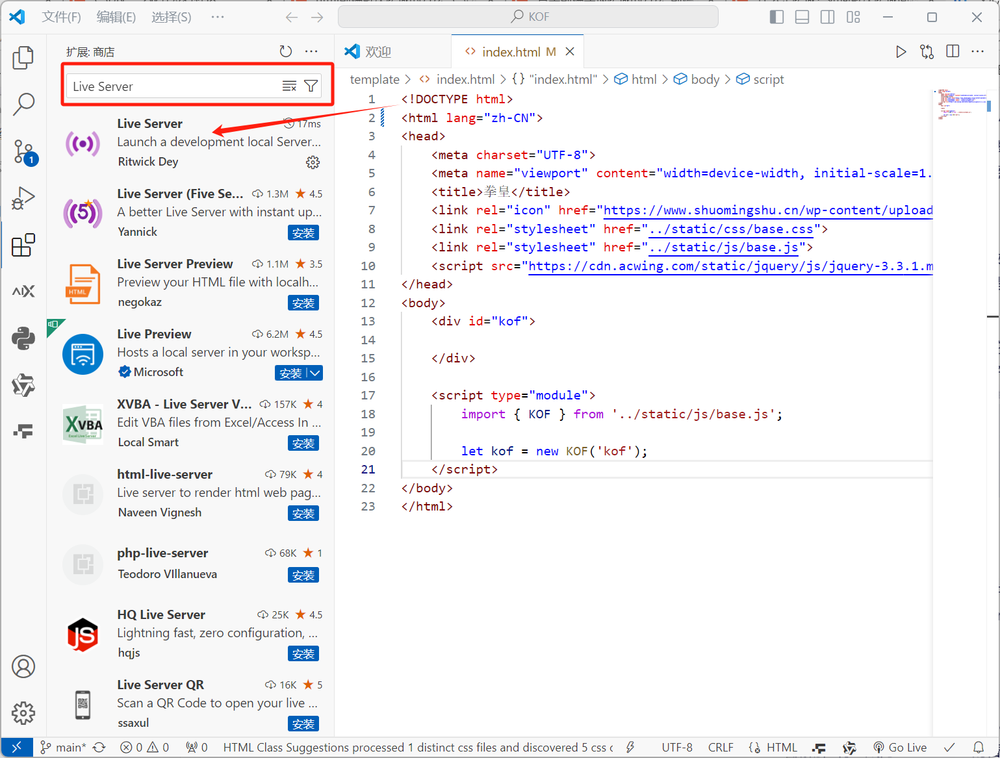
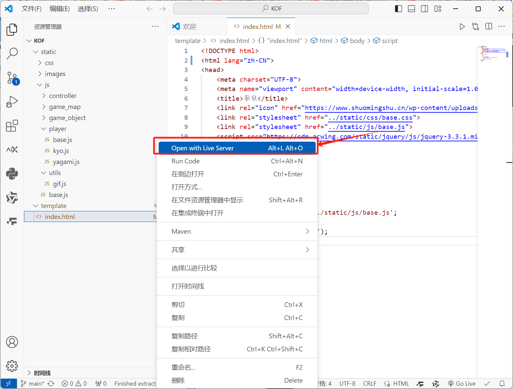
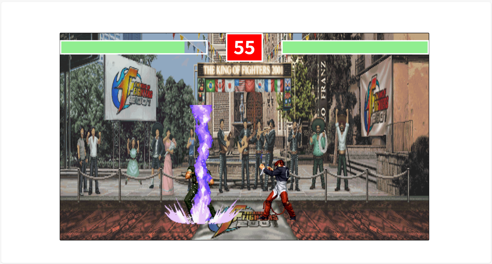
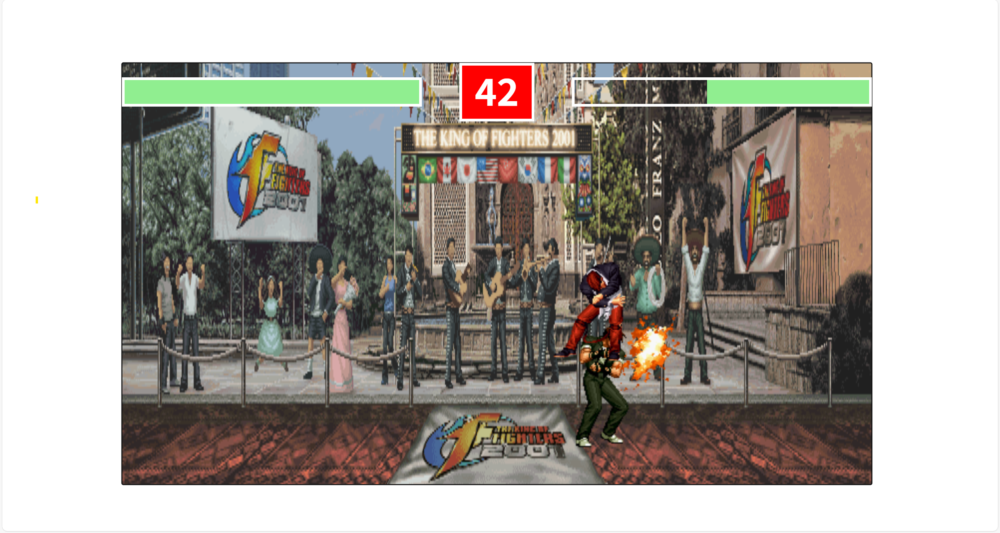
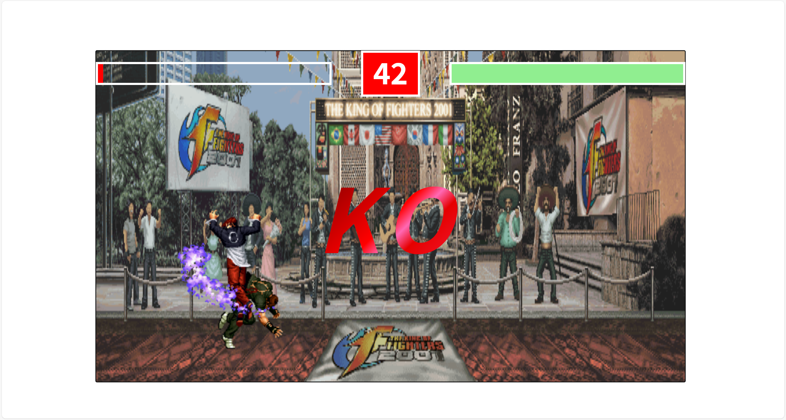

## 自制拳皇小游戏

#### 1.安装

- 途径1：`Code`—`Download ZIP`安装到本地
- 途径2：`git clone`到本地文件夹

#### 2.使用指南

①打开VSCode，在'拓展'中找到并安装`Live Server`插件

②右键`index.html`文件，选择`Open With Live Server`

③浏览器中正常显示游戏页面，可以进行游戏

#### 3.对局说明

玩家1(草薙京)：

`w`--跳  `s`--蹲(防)  `a`--左  `d`--右  `j`--轻击  `k`--重击  `l`--技能

玩家2(八神庵)：

`↑`--跳  `↓`--蹲(防)  `←`--左  `→`--右  `1`--轻击  `2`--重击  `3`--技能

*ps:游戏参数：生命值100 轻击-5 重击-10 技能-15 防御5*

